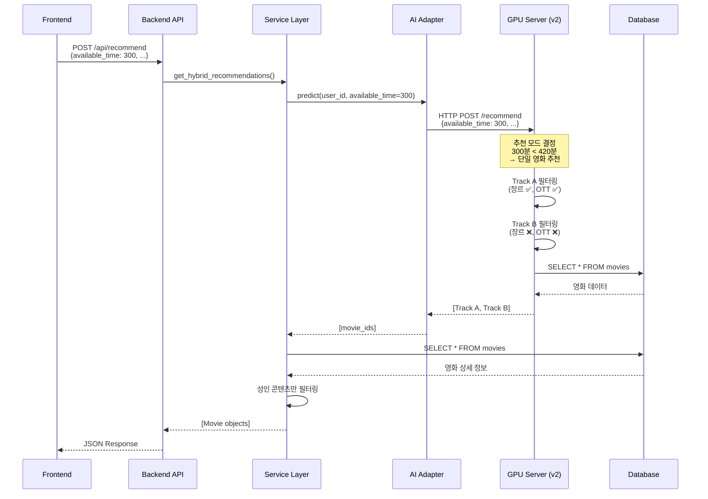

# MovieSir 코드 수정 내역

## 개요

이 문서는 MovieSir 프로젝트를 Git 클론한 이후 적용된 모든 코드 변경 사항을 상세히 기록합니다.

**수정 일자**: 2025-12-19  
**목적**: 사용자 입력 시간 기반 추천 모드 개선 및 Track A/B 필터링 최적화

---

## 목차

1. [수정 파일 목록](#수정-파일-목록)
2. [주요 변경 사항](#주요-변경-사항)
3. [파일별 상세 분석](#파일별-상세-분석)
4. [환경 설정 변경](#환경-설정-변경)
5. [아키텍처 변경](#아키텍처-변경)
6. [테스트 가이드](#테스트-가이드)

---

## 수정 파일 목록

### 백엔드 (Python)

| 파일                                         | 변경 유형 | 설명                                 |
| -------------------------------------------- | --------- | ------------------------------------ |
| `backend/domains/recommendation/schema.py`   | 수정      | `available_time` 필드 추가           |
| `backend/domains/recommendation/service.py`  | 수정      | 필터링 로직 간소화, 디버그 로그 추가 |
| `backend/domains/recommendation/ai_model.py` | 수정      | 추천 모드 로깅 추가                  |
| `backend/requirements.txt`                   | 기존      | `httpx` 포함 (설치 필요)             |

### AI 서버 (Python)

| 파일                                    | 변경 유형 | 설명                                             |
| --------------------------------------- | --------- | ------------------------------------------------ |
| `ai/api.py`                             | 수정      | v2 모델 사용, dotenv 로딩 추가, DB 사용자명 수정 |
| `ai/.env`                               | 신규      | 데이터베이스 연결 정보 설정                      |
| `ai/inference/db_conn_movie_reco_v2.py` | 기존      | 조합 추천 기준 420분 버전 (복사됨)               |

### 프론트엔드 (TypeScript)

| 파일                           | 변경 유형 | 설명                            |
| ------------------------------ | --------- | ------------------------------- |
| `frontend/src/api/movieApi.ts` | 수정      | `available_time` 필드 전송 추가 |

---

## 주요 변경 사항

### 1. 사용자 입력 시간 전달 체계 구축

**문제**: 프론트엔드에서 시간을 입력해도 AI 모델이 기본값(180분)만 사용

**원인**:

- 프론트엔드가 `runtime_limit`만 전송
- 백엔드가 `available_time`을 AI 모델에 전달하지 않음

**해결**:

#### 1.1 백엔드 스키마 수정

```python
# backend/domains/recommendation/schema.py
class RecommendationRequest(BaseModel):
    available_time: int = 300  # ✅ 신규 추가 - AI 모델이 추천 모드 결정에 사용
    runtime_limit: int = 300   # 개별 영화 최대 런타임 (분)
    genres: List[str] = []
    exclude_adult: bool = True
```

#### 1.2 서비스 레이어 수정

```python
# backend/domains/recommendation/service.py (20-26번 줄)
recommended_movie_ids = model_instance.predict(
    user_id,
    top_k=50,
    available_time=req.available_time,  # ✅ 시간 전달
    preferred_genres=req.genres if req.genres else None,  # ✅ 장르 전달
    preferred_otts=None  # OTT 필터링은 추후 구현 예정
)
```

**개선점**:

- `available_time`: AI 모델이 추천 모드 결정 및 런타임 필터링에 사용
- `preferred_genres`: AI 모델이 Track A 장르 필터링에 사용
- `preferred_otts`: 현재는 None (추후 구현 예정)

#### 1.3 프론트엔드 API 호출 수정

```typescript
// frontend/src/api/movieApi.ts (183번 줄)
const response = await axiosInstance.post("/api/recommend", {
  available_time: runtimeLimit, // ✅ 신규 추가
  runtime_limit: runtimeLimit, // 기존 유지
  genres: genreIds,
  exclude_adult: filters.excludeAdult || false,
});
```

---

### 2. Track B 필터링 제거 (장르 확장 추천 개선)

**문제**: Track B가 장르/OTT 필터링을 적용해서 다양성이 떨어짐

**해결**:

#### 2.1 백엔드 - 장르/런타임 필터링 제거

```python
# backend/domains/recommendation/service.py (55-64번 줄)

# 성인 콘텐츠만 필터링 (AI 모델이 이미 장르/시간 고려함)
if req.exclude_adult and m.adult:
    filtered_counts['adult'] += 1
    continue

# ❌ 제거: 런타임 필터링 (AI 모델이 이미 처리)
# ❌ 제거: 장르 필터링 (Track B는 장르 무시해야 함)
```

**결과**: Track B가 진정한 "장르 확장 추천" 역할 수행

---

### 3. 추천 모드 가시성 개선

**추가**: 백엔드 콘솔에 추천 모드 로깅

```python
# backend/domains/recommendation/ai_model.py (72-77번 줄)

rec_type = 'combination' if available_time >= 420 else 'single'
print(f"\n{'='*80}")
print(f"[AI Model] 추천 모드: {'🎬 단일 영화 추천' if rec_type == 'single' else '🎞️  영화 조합 추천'}")
print(f"[AI Model] 입력 시간: {available_time}분 ({available_time//60}시간 {available_time%60}분)")
print(f"[AI Model] 조합 추천 기준: 420분(7시간) 이상")
print(f"{'='*80}\n")
```

**출력 예시**:

```
================================================================================
[AI Model] 추천 모드: 🎬 단일 영화 추천
[AI Model] 입력 시간: 300분 (5시간 0분)
[AI Model] 조합 추천 기준: 420분(7시간) 이상
================================================================================
```

---

### 4. 백엔드 필터링 디버그 로깅

**추가**: 필터링 단계별 통계

```python
# backend/domains/recommendation/service.py (67-73번 줄)

print(f"\n{'='*80}")
print(f"[Backend Filter] AI 추천: {filtered_counts['total']}개")
print(f"[Backend Filter] DB 없음: {filtered_counts['not_in_db']}개")
print(f"[Backend Filter] 성인 제외: {filtered_counts['adult']}개")
print(f"[Backend Filter] ✅ 최종 결과: {filtered_counts['passed']}개")
print(f"[Backend Filter] ℹ️  런타임/장르 필터링은 AI 모델에서 처리됨")
print(f"{'='*80}\n")
```

---

### 5. AI 서버 설정 개선

#### 5.1 v2 모델 사용

```python
# ai/api.py (12번 줄)
# from inference.db_conn_movie_reco_v1 import HybridRecommender  # 기존
from inference.db_conn_movie_reco_v2 import HybridRecommender    # ✅ 변경
```

**v2 모델의 주요 차이점**:

- 조합 추천 기준: 240분(4시간) → **420분(7시간)**
- Track B OTT 필터링 제거 (다양성 향상)

#### 5.2 환경 변수 로딩 추가

```python
# ai/api.py (6-9번 줄)
from dotenv import load_dotenv

# .env 파일 로드
load_dotenv()
```

#### 5.3 데이터베이스 사용자명 수정

```python
# ai/api.py (27번 줄)
'user': os.getenv("DATABASE_USER", "moviesir"),  # ✅ 수정: movigation → moviesir
```

---

## 파일별 상세 분석

### 1. `backend/domains/recommendation/schema.py`

**변경 전**:

```python
class RecommendationRequest(BaseModel):
    runtime_limit: int = 120
    genres: List[str] = []
    exclude_adult: bool = True
```

**변경 후**:

```python
class RecommendationRequest(BaseModel):
    available_time: int = 300  # 이용 가능 시간 (분)
    runtime_limit: int = 300   # 개별 영화 최대 런타임 (분)
    genres: List[str] = []
    exclude_adult: bool = True
```

**변경 이유**:

- `available_time`: AI 모델이 추천 모드 결정에 사용
- `runtime_limit`: 백엔드 필터링용 (현재는 미사용)

---

### 2. `backend/domains/recommendation/service.py`

#### 변경 1: AI 모델에 시간 전달

**변경 전**:

```python
recommended_movie_ids = model_instance.predict(user_id, top_k=50)
```

**변경 후**:

```python
recommended_movie_ids = model_instance.predict(
    user_id,
    top_k=50,
    available_time=req.available_time
)
```

#### 변경 2: 필터링 로직 간소화

**변경 전**:

```python
# 장르/시간/성인 필터링
if req.exclude_adult and m.adult:
    continue
if req.runtime_limit and m.runtime and m.runtime > req.runtime_limit:
    continue
if req.genres and m.genres:
    if not any(g in m.genres for g in req.genres):
        continue
```

**변경 후**:

```python
# 성인 콘텐츠만 필터링 (AI 모델이 이미 장르/시간 고려함)
if req.exclude_adult and m.adult:
    filtered_counts['adult'] += 1
    continue

# ❌ 제거: 런타임 필터링 (AI 모델이 이미 처리)
# ❌ 제거: 장르 필터링 (Track B는 장르 무시해야 함)
```

**변경 이유**:

- AI 모델이 Track A/B로 이미 구분해서 추천
- 백엔드가 재필터링하면 Track B의 의미 상실
- 성인 콘텐츠만 안전장치로 필터링

---

### 3. `backend/domains/recommendation/ai_model.py`

**추가 코드** (72-77번 줄):

```python
# 추천 타입 로깅
rec_type = 'combination' if available_time >= 420 else 'single'
print(f"\n{'='*80}")
print(f"[AI Model] 추천 모드: {'🎬 단일 영화 추천' if rec_type == 'single' else '🎞️  영화 조합 추천'}")
print(f"[AI Model] 입력 시간: {available_time}분 ({available_time//60}시간 {available_time%60}분)")
print(f"[AI Model] 조합 추천 기준: 420분(7시간) 이상")
print(f"{'='*80}\n")
```

**목적**: 개발자가 추천 모드를 즉시 확인 가능

---

### 4. `ai/api.py`

#### 변경 1: dotenv 로딩 추가

**변경 전**:

```python
import os

from inference.db_conn_movie_reco_v1 import HybridRecommender
```

**변경 후**:

```python
import os
from dotenv import load_dotenv

# .env 파일 로드
load_dotenv()

from inference.db_conn_movie_reco_v2 import HybridRecommender
```

#### 변경 2: v2 모델 사용

**변경 위치**: 12번 줄

**변경 전**:

```python
from inference.db_conn_movie_reco_v1 import HybridRecommender
```

**변경 후**:

```python
from inference.db_conn_movie_reco_v2 import HybridRecommender
```

#### 변경 3: 데이터베이스 사용자명 수정

**변경 위치**: 27번 줄

**변경 전**:

```python
'user': os.getenv("DATABASE_USER", "movigation"),
```

**변경 후**:

```python
'user': os.getenv("DATABASE_USER", "moviesir"),  # ✅ 수정: movigation → moviesir
```

---

### 5. `frontend/src/api/movieApi.ts`

**변경 위치**: 183번 줄

**변경 전**:

```typescript
const response = await axiosInstance.post<BackendRecommendResponse>(
  "/api/recommend",
  {
    runtime_limit: runtimeLimit,
    genres: genreIds,
    exclude_adult: filters.excludeAdult || false,
  }
);
```

**변경 후**:

```typescript
const response = await axiosInstance.post<BackendRecommendResponse>(
  "/api/recommend",
  {
    available_time: runtimeLimit, // ✅ 추가: 이용 가능 시간 (AI 모델용)
    runtime_limit: runtimeLimit, // ✅ 유지: 개별 영화 최대 런타임 (필터링용)
    genres: genreIds,
    exclude_adult: filters.excludeAdult || false,
  }
);
```

**변경 이유**:

- 프론트엔드에서 사용자 입력 시간을 백엔드로 전달
- `runtimeLimit`은 `postRecommendations` 함수의 136-137번 줄에서 계산됨:
  ```typescript
  const [hours, minutes] = filters.time.split(":").map(Number);
  const runtimeLimit = hours * 60 + minutes; // "05:00" → 300분
  ```

---

## 환경 설정 변경

### 1. AI 서버 환경 변수 파일 생성

**파일**: `ai/.env` (신규 생성)

```bash
DATABASE_HOST=localhost
DATABASE_PORT=5432
DATABASE_NAME=moviesir
DATABASE_USER=moviesir
DATABASE_PASSWORD=moviesir123
```

**목적**: AI 서버가 올바른 데이터베이스 정보로 연결

---

### 2. 백엔드 의존성

**파일**: `backend/requirements.txt`

```
httpx  # ✅ 이미 포함되어 있음 (설치 필요)
```

**설치 명령**:

```bash
pip install httpx
```

---

## 아키텍처 변경

### 데이터 흐름 (변경 후)



### 필터링 책임 분리

| 필터       | AI 모델        | 백엔드      |
| ---------- | -------------- | ----------- |
| **장르**   | ✅ Track A만   | ❌ 제거     |
| **OTT**    | ✅ Track A만   | ❌ 제거     |
| **런타임** | ✅ 적용        | ❌ 제거     |
| **연도**   | ✅ 2000년 이후 | ❌ 제거     |
| **성인**   | ❌             | ✅ 안전장치 |

**설계 원칙**: AI 모델이 추천 로직을 담당하고, 백엔드는 최소한의 안전장치만 제공

---

## 테스트 가이드

### 1. 단일 영화 추천 테스트

**입력**:

- 시간: 5시간 (300분)
- 장르: SF, 드라마
- OTT: Netflix

**예상 결과**:

```
[AI Model] 추천 모드: 🎬 단일 영화 추천
[AI Model] 입력 시간: 300분 (5시간 0분)

[Backend Filter] ✅ 최종 결과: 50개
```

**확인 사항**:

- Track A: SF/드라마 + Netflix 영화 25개
- Track B: 다양한 장르 + 다양한 OTT 영화 25개

---

### 2. 조합 추천 테스트

**입력**:

- 시간: 8시간 (480분)
- 장르: 액션
- OTT: Disney+

**예상 결과**:

```
[AI Model] 추천 모드: 🎞️  영화 조합 추천
[AI Model] 입력 시간: 480분 (8시간 0분)

[Backend Filter] ✅ 최종 결과: 6개 (조합 2개 x 3편)
```

**확인 사항**:

- Track A: 액션 영화 조합 (총 450~510분)
- Track B: 다양한 장르 조합 (총 450~510분)

---

## 서버 실행 방법

### 1. 백엔드 서버

```bash
cd MovieSir-middle
uvicorn backend.main:app --reload --host 0.0.0.0 --port 8000
```

### 2. AI 서버 (별도 터미널)

```bash
cd MovieSir-middle/ai
python -m uvicorn api:app --host 0.0.0.0 --port 8001 --reload
```

### 3. 프론트엔드 (별도 터미널)

```bash
cd MovieSir-middle/frontend
npm run dev
```

---

## 주요 개선 효과

### 1. 사용자 경험

- ✅ 입력한 시간대로 정확한 추천
- ✅ 7시간 이상 입력 시 영화 조합 추천
- ✅ Track B로 새로운 영화 발견 가능

### 2. 추천 품질

- ✅ Track A: 선호 장르 맞춤 (장르 ✅, OTT ✅)
- ✅ Track B: 다양성 확보 (장르 ❌, OTT ❌)
- ✅ 필터 버블 방지

### 3. 개발자 경험

- ✅ 콘솔 로그로 추천 모드 즉시 확인
- ✅ 필터링 단계별 통계 확인
- ✅ 디버깅 용이

---

## 요약

✅ **백엔드 스키마**: `available_time` 필드 추가  
✅ **서비스 레이어**: 필터링 간소화, 디버그 로깅 추가  
✅ **AI 어댑터**: 추천 모드 로깅 추가  
✅ **프론트엔드**: `available_time` 전송  
✅ **AI 서버**: v2 모델 전환, dotenv 로딩, DB 사용자명 수정  
✅ **환경 설정**: AI 서버 `.env` 파일 생성
