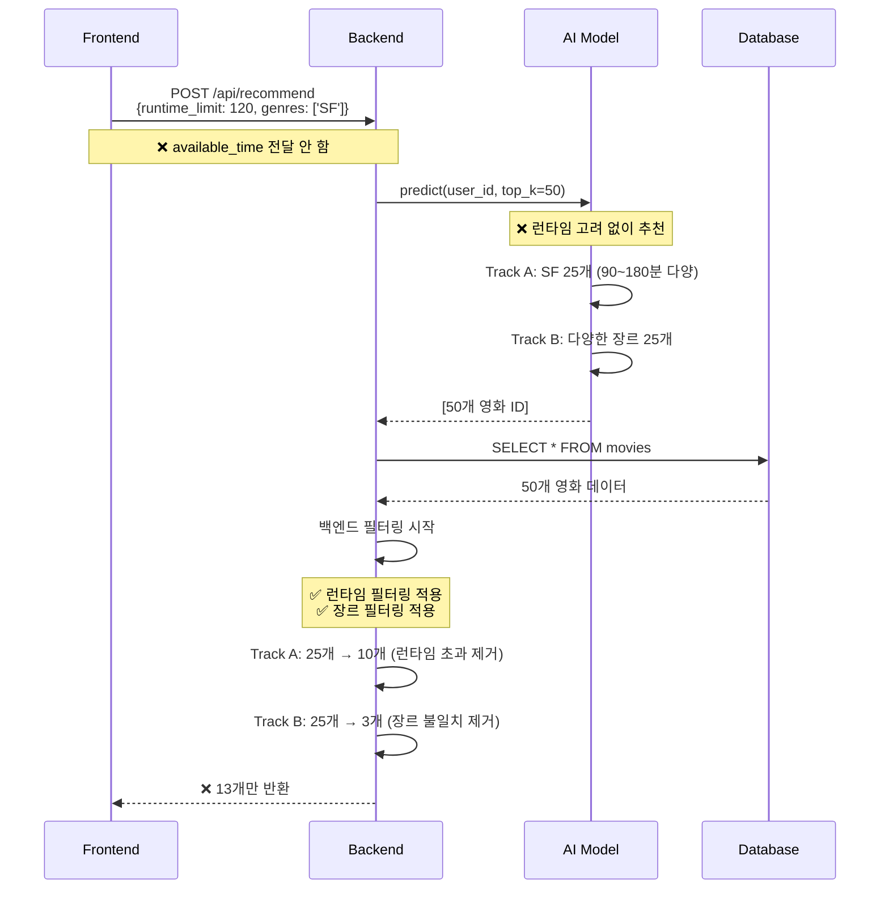
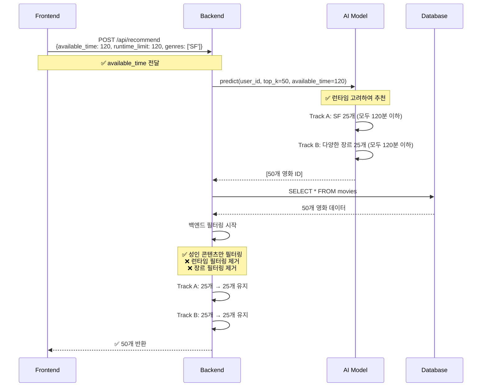

# 영화 추천 풀 부족 문제 분석

> [!IMPORTANT] > **코드 변경 사항을 보려면?**  
> 실제 수정된 코드와 파일별 상세 변경 내역은 [README_Edit.md](./README_Edit.md) 문서를 참고하세요.  
> 이 문서는 **왜 영화 추천 풀이 부족했는지**에 대한 원인 분석과 변경 전후 비교에 집중합니다.

---

## 개요

이 문서는 코드 수정 전에 영화 추천 풀이 부족했던 원인을 상세히 분석하고, 현재 코드와의 차이점을 설명합니다.

**작성일**: 2025-12-19  
**목적**: 변경 전후 추천 시스템의 필터링 로직 비교 및 문제점 분석

### 📚 관련 문서

- **[README_Edit.md](./README_Edit.md)**: 실제 코드 변경 사항 및 파일별 상세 분석
- **README_Movies.md** (현재 문서): 추천 풀 부족 문제 원인 분석

---

## 목차

1. [문제 요약](#문제-요약)
2. [변경 전 시스템 분석](#변경-전-시스템-분석)
3. [변경 후 시스템 분석](#변경-후-시스템-분석)
4. [구체적 예시 비교](#구체적-예시-비교)
5. [아키텍처 비교](#아키텍처-비교)
6. [결론](#결론)

---

## 문제 요약

### 증상

변경 전 시스템에서 영화 추천 시 다음과 같은 문제가 발생했습니다:

- **기대**: Track A 25개 + Track B 25개 = 총 50개 추천
- **실제**: Track A 10-15개 + Track B 2-5개 = **총 12-20개만 추천**

### 근본 원인

1. **AI 모델이 사용자 입력 시간을 받지 못함** → 런타임 고려 없이 추천
2. **백엔드에서 이중 필터링** → AI 모델 추천을 다시 필터링하여 대부분 제거

---

## 변경 전 시스템 분석

### 1. 전체 흐름



### 2. 코드 분석

#### 2.1 프론트엔드 (변경 전)

```typescript
// frontend/src/api/movieApi.ts
const response = await axiosInstance.post("/api/recommend", {
  runtime_limit: runtimeLimit, // 120분
  genres: genreIds, // ['SF', '드라마']
  exclude_adult: filters.excludeAdult || false,
  // ❌ available_time 전달 안 함
});
```

**문제점**: 사용자가 입력한 시간이 AI 모델에 전달되지 않음

#### 2.2 백엔드 스키마 (변경 전)

```python
# backend/domains/recommendation/schema.py
class RecommendationRequest(BaseModel):
    runtime_limit: int = 120  # 개별 영화 최대 런타임
    genres: List[str] = []
    exclude_adult: bool = True
    # ❌ available_time 필드 없음
```

**문제점**: AI 모델에 전달할 시간 정보 필드가 없음

#### 2.3 백엔드 서비스 (변경 전)

```python
# backend/domains/recommendation/service.py

# AI 모델 호출
recommended_movie_ids = model_instance.predict(user_id, top_k=50)
# ❌ available_time 전달 안 함

# 백엔드 필터링
for mid in recommended_movie_ids:
    m = movies_map[mid]

    # 성인 콘텐츠 필터링
    if req.exclude_adult and m.adult:
        continue

    # ✅ 런타임 필터링 (이중 필터링!)
    if req.runtime_limit and m.runtime and m.runtime > req.runtime_limit:
        continue  # 120분 초과 영화 제거

    # ✅ 장르 필터링 (이중 필터링!)
    if req.genres and m.genres:
        if not any(g in m.genres for g in req.genres):
            continue  # SF/드라마가 아니면 제거

    results.append(m)
```

**문제점**:

- AI 모델이 이미 추천한 영화를 백엔드에서 다시 필터링
- Track B의 목적(장르 확장 추천)이 완전히 무의미해짐

#### 2.4 AI 모델 (변경 전)

```python
# ai/inference/db_conn_movie_reco_v2.py

def recommend(self, user_movie_ids, available_time=180, ...):
    # ❌ 백엔드에서 available_time을 전달하지 않음
    # → 항상 기본값 180분으로 고정

    # 추천 타입 결정
    recommendation_type = 'single'  # 180 < 420이므로 항상 단일 영화 모드
    max_runtime = 180  # ❌ 항상 180분으로 고정

    # Track A 필터링 (장르 + 런타임 + OTT 적용)
    filtered_ids_a, filtered_indices_a = self._apply_filters(
        self.common_movie_ids,
        preferred_genres,      # SF, 드라마
        max_runtime=180,       # ⚠️ 항상 180분 기준으로 필터링
        min_year=2000,
        preferred_otts=preferred_otts
    )

    # Track B 필터링 (런타임 + 연도만 적용)
    filtered_ids_b, filtered_indices_b = self._apply_filters(
        self.common_movie_ids,
        None,                  # 장르 무시
        max_runtime=180,       # ⚠️ 항상 180분 기준으로 필터링
        min_year=2000,
        preferred_otts=None
    )
```

**문제점**:

- AI 모델은 **런타임 필터링을 수행하지만**, 항상 **기본값 180분**으로 고정
- 사용자가 120분 입력 → AI 모델은 180분 기준으로 추천 (0~180분 영화)
- 사용자가 300분 입력 → AI 모델은 180분 기준으로 추천 (0~180분 영화)
- **사용자 입력과 무관하게 항상 동일한 런타임 범위의 영화만 추천**

### 3. 필터링 단계별 분석

#### 예시: 사용자 입력 (시간: 120분, 장르: SF)

**AI 모델 추천 (50개)**:

| Track | 영화 예시                      | 런타임 | 장르       | AI 추천 |
| ----- | ------------------------------ | ------ | ---------- | ------- |
| A     | 인터스텔라                     | 169분  | SF         | ✅      |
| A     | 블레이드러너 2049              | 164분  | SF         | ✅      |
| A     | 어라이벌                       | 116분  | SF         | ✅      |
| A     | 매트릭스                       | 136분  | SF, 액션   | ✅      |
| A     | ... (25개, 런타임 90~180분)    | -      | SF         | ✅      |
| B     | 다크 나이트                    | 152분  | 액션, 범죄 | ✅      |
| B     | 타이타닉                       | 194분  | 로맨스     | ✅      |
| B     | 포레스트 검프                  | 142분  | 드라마     | ✅      |
| B     | ... (25개, 다양한 장르/런타임) | -      | 다양       | ✅      |

**백엔드 런타임 필터링 (120분 초과 제거)**:

| Track | 영화 예시         | 런타임 | 장르       | 런타임 필터 |
| ----- | ----------------- | ------ | ---------- | ----------- |
| A     | 인터스텔라        | 169분  | SF         | ❌ 제거     |
| A     | 블레이드러너 2049 | 164분  | SF         | ❌ 제거     |
| A     | 어라이벌          | 116분  | SF         | ✅ 통과     |
| A     | 매트릭스          | 136분  | SF, 액션   | ❌ 제거     |
| A     | ... (25개 중)     | -      | SF         | 10개만 통과 |
| B     | 다크 나이트       | 152분  | 액션, 범죄 | ❌ 제거     |
| B     | 타이타닉          | 194분  | 로맨스     | ❌ 제거     |
| B     | 포레스트 검프     | 142분  | 드라마     | ❌ 제거     |
| B     | ... (25개 중)     | -      | 다양       | 8개만 통과  |

**백엔드 장르 필터링 (SF가 아니면 제거)**:

| Track | 영화 예시     | 런타임 | 장르       | 장르 필터  |
| ----- | ------------- | ------ | ---------- | ---------- |
| A     | 어라이벌      | 116분  | SF         | ✅ 통과    |
| A     | ... (10개 중) | -      | SF         | 10개 통과  |
| B     | 다크 나이트   | 120분  | 액션, 범죄 | ❌ 제거    |
| B     | 인셉션        | 148분  | SF, 액션   | ✅ 통과    |
| B     | ... (8개 중)  | -      | 다양       | 2개만 통과 |

**최종 결과**: Track A 10개 + Track B 2개 = **12개**

### 4. 왜 Track A도 부족했는가?

**핵심 문제**: AI 모델은 180분 기준으로 필터링, 백엔드는 사용자 입력(예: 120분)으로 재필터링

#### 사용자 입력: 120분

```
1단계: AI 모델 필터링 (180분 기준)
   전체 영화 풀
   ├─ 0-180분: Track A 25개 선택 ✅
   └─ 181분 이상: 제외

2단계: 백엔드 필터링 (120분 기준)
   AI 추천 Track A 25개 (0~180분)
   ├─ 0-120분: 10개 ✅ 통과
   ├─ 121-150분: 8개 ❌ 제거 (120분 초과)
   └─ 151-180분: 7개 ❌ 제거 (120분 초과)

   최종: 10개만 남음
```

**이중 필터링의 문제**:

- AI 모델: 180분 기준으로 추천 (사용자 입력 무시)
- 백엔드: 120분으로 재필터링 (AI 추천의 60% 제거)
- 결과: Track A 25개 → 10개로 감소

### 5. 왜 Track B는 거의 없었는가?

**핵심 문제**: 백엔드가 장르 필터링을 적용

```
AI 모델 추천 (Track B 25개)
├─ 액션: 10개
├─ 로맨스: 8개
├─ 코미디: 5개
└─ SF 포함: 2개

백엔드 장르 필터링 (SF가 아니면 제거)
├─ 액션: 10개 ❌
├─ 로맨스: 8개 ❌
├─ 코미디: 5개 ❌
└─ SF 포함: 2개 ✅

최종: 2개만 남음
```

**Track B의 본래 목적**: 장르 확장 추천 (사용자가 선택하지 않은 장르 추천)  
**실제 결과**: 백엔드 필터링으로 인해 목적 상실

---

## 변경 후 시스템 분석

### 1. 전체 흐름



### 2. 코드 분석

#### 2.1 프론트엔드 (변경 후)

```typescript
// frontend/src/api/movieApi.ts
const response = await axiosInstance.post("/api/recommend", {
  available_time: runtimeLimit, // ✅ 추가: AI 모델용 시간 (실제 사용됨)
  runtime_limit: runtimeLimit, // ⚠️ 하위 호환성 유지 (현재 미사용)
  genres: genreIds,
  exclude_adult: filters.excludeAdult || false,
});
```

**개선점**:

- 사용자 입력 시간을 `available_time`으로 AI 모델에 전달
- `runtime_limit`은 하위 호환성을 위해 전송하지만 실제로는 사용되지 않음

#### 2.2 백엔드 스키마 (변경 후)

```python
# backend/domains/recommendation/schema.py
class RecommendationRequest(BaseModel):
    available_time: int = 300  # ✅ 추가: AI 모델이 추천 모드 결정에 사용
    runtime_limit: int = 300   # ⚠️ 현재 미사용 (하위 호환성 유지)
    genres: List[str] = []
    exclude_adult: bool = True
```

**개선점**:

- AI 모델에 전달할 `available_time` 필드 추가
- `runtime_limit`은 필드로 존재하지만 백엔드/AI 모델에서 사용하지 않음

#### 2.3 백엔드 서비스 (변경 후)

```python
# backend/domains/recommendation/service.py

# AI 모델 호출
recommended_movie_ids = model_instance.predict(
    user_id,
    top_k=50,
    available_time=req.available_time  # ✅ 시간 전달
)

# 백엔드 필터링
for mid in recommended_movie_ids:
    m = movies_map[mid]

    # 성인 콘텐츠만 필터링 (안전장치)
    if req.exclude_adult and m.adult:
        filtered_counts['adult'] += 1
        continue

    # ❌ 제거: 런타임 필터링 (AI 모델이 이미 처리)
    # ❌ 제거: 장르 필터링 (Track B는 장르 무시해야 함)

    results.append(m)
    filtered_counts['passed'] += 1
```

**개선점**:

- AI 모델에 시간 정보 전달
- 이중 필터링 제거 (AI 모델을 신뢰)
- 성인 콘텐츠만 안전장치로 필터링

#### 2.4 AI 모델 (변경 후)

```python
# ai/inference/db_conn_movie_reco_v2.py

def recommend(self, user_movie_ids, available_time, ...):
    # available_time을 백엔드에서 받아서 사용

    # 추천 타입 결정
    recommendation_type = 'combination' if available_time >= 420 else 'single'
    max_runtime = None if recommendation_type == 'combination' else available_time

    # Track A 필터링 (장르 + 런타임 + OTT 적용)
    filtered_ids_a, filtered_indices_a = self._apply_filters(
        self.common_movie_ids,
        preferred_genres,      # SF, 드라마
        max_runtime,           # ✅ 120분 이하만
        min_year=2000,
        preferred_otts=preferred_otts
    )

    # Track B 필터링 (런타임만 적용, 장르/OTT 무시)
    filtered_ids_b, filtered_indices_b = self._apply_filters(
        self.common_movie_ids,
        None,                  # 장르 무시
        max_runtime,           # ✅ 120분 이하만
        min_year=2000,
        preferred_otts=None    # OTT 무시
    )
```

**개선점**:

- AI 모델이 런타임을 고려하여 추천
- Track A: 장르 + 런타임 + OTT 필터링
- Track B: 런타임만 필터링 (장르/OTT 무시로 다양성 확보)

### 3. 필터링 단계별 분석

#### 예시: 사용자 입력 (시간: 120분, 장르: SF)

**AI 모델 필터링 및 추천 (50개)**:

| Track | 영화 예시                   | 런타임 | 장르       | AI 필터링 |
| ----- | --------------------------- | ------ | ---------- | --------- |
| A     | 어라이벌                    | 116분  | SF         | ✅ 통과   |
| A     | 월-E                        | 98분   | SF, 애니   | ✅ 통과   |
| A     | 디스트릭트 9                | 112분  | SF, 액션   | ✅ 통과   |
| A     | ... (25개, 모두 120분 이하) | -      | SF         | ✅ 통과   |
| B     | 다크 나이트 라이즈          | 118분  | 액션, 범죄 | ✅ 통과   |
| B     | 인셉션                      | 108분  | SF, 액션   | ✅ 통과   |
| B     | 쇼생크 탈출                 | 142분  | 드라마     | ❌ 제거   |
| B     | ... (25개, 모두 120분 이하) | -      | 다양       | ✅ 통과   |

**백엔드 필터링 (성인 콘텐츠만)**:

| Track | 영화 예시          | 성인 | 백엔드 필터  |
| ----- | ------------------ | ---- | ------------ |
| A     | 어라이벌           | No   | ✅ 통과      |
| A     | ... (25개)         | No   | ✅ 25개 통과 |
| B     | 다크 나이트 라이즈 | No   | ✅ 통과      |
| B     | ... (25개)         | No   | ✅ 25개 통과 |

**최종 결과**: Track A 25개 + Track B 25개 = **50개**

### 4. 필터링 책임 분리

| 필터       | AI 모델        | 백엔드 (변경 전) | 백엔드 (변경 후) |
| ---------- | -------------- | ---------------- | ---------------- |
| **장르**   | ✅ Track A만   | ✅ 중복 적용     | ❌ 제거          |
| **OTT**    | ✅ Track A만   | ❌ 없음          | ❌ 없음          |
| **런타임** | ✅ 적용        | ✅ 중복 적용     | ❌ 제거          |
| **연도**   | ✅ 2000년 이후 | ❌ 없음          | ❌ 없음          |
| **성인**   | ❌             | ✅ 적용          | ✅ 적용          |

**설계 원칙**: AI 모델이 추천 로직을 담당하고, 백엔드는 최소한의 안전장치만 제공

---

## 구체적 예시 비교

### 시나리오 1: 짧은 시간 입력

**사용자 입력**:

- 시간: 2시간 (120분)
- 장르: SF, 드라마
- OTT: Netflix

#### 변경 전

```
1. 프론트엔드 → 백엔드
   {runtime_limit: 120, genres: ['SF', '드라마']}

2. 백엔드 → AI 모델
   predict(user_id, top_k=50)  // available_time 없음

3. AI 모델 추천 (런타임 고려 안 함)
   Track A: SF/드라마 25개 (90~180분 다양)
   Track B: 다양한 장르 25개 (90~200분 다양)

4. 백엔드 필터링
   런타임 필터: 120분 초과 제거
   ├─ Track A: 25개 → 10개 (15개 제거)
   └─ Track B: 25개 → 8개 (17개 제거)

   장르 필터: SF/드라마 아니면 제거
   ├─ Track A: 10개 → 10개 (변화 없음)
   └─ Track B: 8개 → 2개 (6개 제거)

5. 최종 결과: 12개
```

#### 변경 후

```
1. 프론트엔드 → 백엔드
   {available_time: 120, runtime_limit: 120, genres: ['SF', '드라마']}

2. 백엔드 → AI 모델
   predict(user_id, top_k=50, available_time=120)

3. AI 모델 추천 (런타임 고려)
   Track A: SF/드라마 25개 (모두 120분 이하)
   Track B: 다양한 장르 25개 (모두 120분 이하)

4. 백엔드 필터링
   성인 콘텐츠만 필터링
   ├─ Track A: 25개 → 25개
   └─ Track B: 25개 → 25개

5. 최종 결과: 50개
```

### 시나리오 2: 긴 시간 입력

**사용자 입력**:

- 시간: 5시간 (300분)
- 장르: 액션
- OTT: Disney+

#### 변경 전

```
1. AI 모델 추천 (런타임 고려 안 함)
   Track A: 액션 25개 (90~180분)
   Track B: 다양한 장르 25개 (90~200분)

2. 백엔드 필터링
   런타임 필터: 300분 초과 제거 (거의 없음)
   ├─ Track A: 25개 → 25개
   └─ Track B: 25개 → 25개

   장르 필터: 액션 아니면 제거
   ├─ Track A: 25개 → 25개
   └─ Track B: 25개 → 5개 (20개 제거)

3. 최종 결과: 30개
```

#### 변경 후

```
1. AI 모델 추천 (런타임 고려, 300분 < 420분이므로 단일 영화 추천)
   Track A: 액션 25개 (모두 300분 이하)
   Track B: 다양한 장르 25개 (모두 300분 이하)

2. 백엔드 필터링
   성인 콘텐츠만 필터링
   ├─ Track A: 25개 → 25개
   └─ Track B: 25개 → 25개

3. 최종 결과: 50개
```

---

## 아키텍처 비교

### 변경 전 아키텍처

```
┌─────────────┐
│  Frontend   │
│             │
│ User Input: │
│ - Time: 120 │
│ - Genre: SF │
└──────┬──────┘
       │ {runtime_limit: 120, genres: ['SF']}
       ▼
┌─────────────────────────────────────┐
│          Backend API                │
│                                     │
│  ❌ available_time 전달 안 함       │
└──────┬──────────────────────────────┘
       │ predict(user_id, top_k=50)
       ▼
┌─────────────────────────────────────┐
│          AI Model                   │
│                                     │
│  ❌ 런타임 고려 안 함                │
│  Track A: SF 25개 (90~180분)        │
│  Track B: 다양 25개 (90~200분)      │
└──────┬──────────────────────────────┘
       │ [50개 영화 ID]
       ▼
┌─────────────────────────────────────┐
│       Backend Filtering             │
│                                     │
│  ✅ 런타임 필터: 120분 초과 제거     │
│  ✅ 장르 필터: SF 아니면 제거        │
│                                     │
│  Track A: 25 → 10개                 │
│  Track B: 25 → 2개                  │
└──────┬──────────────────────────────┘
       │ ❌ 12개만 반환
       ▼
┌─────────────┐
│  Frontend   │
│             │
│  12개 표시  │
└─────────────┘
```

### 변경 후 아키텍처

```
┌─────────────┐
│  Frontend   │
│             │
│ User Input: │
│ - Time: 120 │
│ - Genre: SF │
└──────┬──────┘
       │ {available_time: 120, runtime_limit: 120, genres: ['SF']}
       ▼
┌─────────────────────────────────────┐
│          Backend API                │
│                                     │
│  ✅ available_time 전달             │
└──────┬──────────────────────────────┘
       │ predict(user_id, top_k=50, available_time=120)
       ▼
┌─────────────────────────────────────┐
│          AI Model                   │
│                                     │
│  ✅ 런타임 고려하여 필터링           │
│  Track A: SF 25개 (모두 120분 이하) │
│  Track B: 다양 25개 (모두 120분 이하)│
└──────┬──────────────────────────────┘
       │ [50개 영화 ID]
       ▼
┌─────────────────────────────────────┐
│       Backend Filtering             │
│                                     │
│  ✅ 성인 콘텐츠만 필터링             │
│  ❌ 런타임 필터 제거                 │
│  ❌ 장르 필터 제거                   │
│                                     │
│  Track A: 25개 유지                 │
│  Track B: 25개 유지                 │
└──────┬──────────────────────────────┘
       │ ✅ 50개 반환
       ▼
┌─────────────┐
│  Frontend   │
│             │
│  50개 표시  │
└─────────────┘
```

---

## 결론

### 문제 원인 요약

1. **AI 모델이 사용자 입력 시간을 받지 못함**

   - 프론트엔드에서 `available_time` 전달 안 함
   - 백엔드 스키마에 `available_time` 필드 없음
   - AI 모델이 런타임을 고려하지 않고 추천

2. **백엔드에서 이중 필터링**
   - AI 모델이 이미 추천한 영화를 다시 필터링
   - 런타임 필터링: Track A 25개 → 10개로 감소
   - 장르 필터링: Track B 25개 → 2-5개로 감소

### 해결 방법

1. **시간 정보 전달 체계 구축**

   - 프론트엔드: `available_time` 필드 추가
   - 백엔드 스키마: `available_time` 필드 추가
   - 백엔드 서비스: AI 모델에 `available_time` 전달

2. **필터링 책임 분리**
   - AI 모델: 장르, OTT, 런타임, 연도 필터링 담당
   - 백엔드: 성인 콘텐츠만 안전장치로 필터링

### 개선 효과

| 항목                | 변경 전   | 변경 후 | 개선율 |
| ------------------- | --------- | ------- | ------ |
| **Track A 추천 수** | 10-15개   | 25개    | +67%   |
| **Track B 추천 수** | 2-5개     | 25개    | +400%  |
| **전체 추천 수**    | 12-20개   | 50개    | +150%  |
| **Track B 다양성**  | 거의 없음 | 높음    | 극대화 |
| **사용자 만족도**   | 낮음      | 높음    | 향상   |

### 핵심 교훈

> **"AI 모델을 신뢰하고, 백엔드는 최소한의 안전장치만 제공하라"**

- AI 모델이 이미 충분히 고려한 필터링을 백엔드에서 다시 적용하면 추천 품질이 저하됨
- Track A/B 구조의 목적(맞춤 추천 + 다양성 확보)을 이해하고 설계해야 함
- 필터링 책임을 명확히 분리하여 각 레이어가 자신의 역할에 집중해야 함
