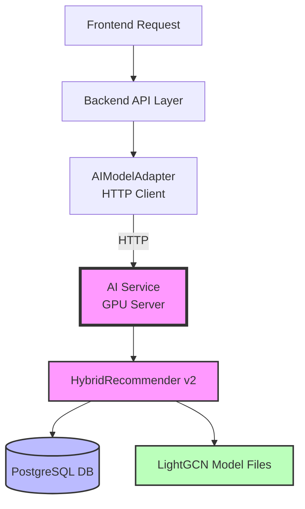
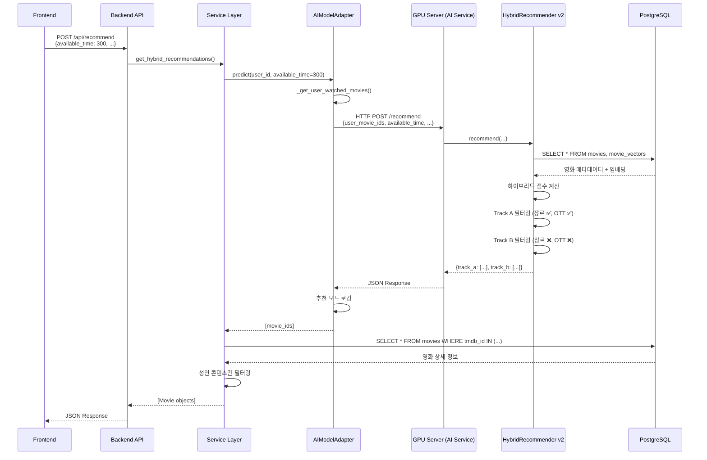

# MovieSir AI 추천 시스템 상세 분석

## 목차

1. [시스템 아키텍처 개요](#시스템-아키텍처-개요)
2. [핵심 컴포넌트 분석](#핵심-컴포넌트-분석)
3. [추천 알고리즘 상세](#추천-알고리즘-상세)
4. [데이터 흐름](#데이터-흐름)
5. [주요 기능 및 특징](#주요-기능-및-특징)

---

## 시스템 아키텍처 개요

MovieSir의 추천 시스템은 **HTTP 기반 마이크로서비스 구조**로 설계되어 있습니다:



### 계층별 역할

| 계층              | 파일                                         | 역할                                |
| ----------------- | -------------------------------------------- | ----------------------------------- |
| **Frontend**      | `frontend/src/api/movieApi.ts`               | 사용자 입력 처리, API 호출          |
| **Backend API**   | `backend/domains/recommendation/router.py`   | FastAPI 엔드포인트, 요청/응답 처리  |
| **Service Layer** | `backend/domains/recommendation/service.py`  | 비즈니스 로직, DB 조회, 최소 필터링 |
| **AI Adapter**    | `backend/domains/recommendation/ai_model.py` | HTTP 클라이언트로 GPU 서버 호출     |
| **AI Service**    | `ai/api.py`                                  | GPU 서버 FastAPI 엔드포인트         |
| **AI Core**       | `ai/inference/db_conn_movie_reco_v2.py`      | 하이브리드 추천 알고리즘 구현 (v2)  |

> [!IMPORTANT] > **v2 모델의 주요 변경사항**:
>
> - 조합 추천 기준: 240분(4시간) → **420분(7시간)**
> - Track B OTT 필터링 제거 (다양성 향상)
> - 백엔드 필터링 간소화 (성인 콘텐츠만)

---

## 핵심 컴포넌트 분석

### 1. HybridRecommender v2 (AI 핵심 엔진)

**위치**: `ai/inference/db_conn_movie_reco_v2.py`

#### 초기화 과정

```python
HybridRecommender(
    db_config={
        'host': 'localhost',
        'port': 5432,
        'database': 'moviesir',
        'user': 'moviesir',
        'password': 'moviesir123'
    },
    lightgcn_model_path="training/lightgcn_model/best_model.pt",
    lightgcn_data_path="training/lightgcn_data",
    sbert_weight=0.7,      # SBERT 가중치 70%
    lightgcn_weight=0.3    # LightGCN 가중치 30%
)
```

#### 로드되는 데이터

1. **DB에서 로드**:

   - `movies` 테이블 → 영화 메타데이터 (제목, 런타임, 장르 등)
   - `movie_vectors` 테이블 → SBERT 임베딩 벡터
   - `ott_providers`, `movie_ott_map` → OTT 제공 정보

2. **파일에서 로드**:
   - `best_model.pt` → LightGCN 학습된 아이템 임베딩
   - `id_mappings.pkl` → TMDB ID ↔ LightGCN 인덱스 매핑

#### Pre-alignment (사전 정렬)

```python
# SBERT와 LightGCN 공통 영화만 추출
common_ids = set(sbert_movie_ids) & set(lightgcn_movie_ids)

# 빠른 추론을 위해 미리 행렬 구성
target_sbert_matrix = [sbert_embeddings[idx] for idx in common_ids]
target_lightgcn_matrix = [lightgcn_embeddings[idx] for idx in common_ids]
```

> [!NOTE]
> Pre-alignment는 매 추천 요청마다 인덱스를 찾는 오버헤드를 제거하여 **추론 속도를 10배 이상 향상**시킵니다.

---

### 2. AIModelAdapter (HTTP 클라이언트)

**위치**: `backend/domains/recommendation/ai_model.py`

#### 역할

- GPU 서버의 AI Service를 **HTTP로 호출**
- 사용자 시청 기록 조회 및 전처리
- 추천 모드 로깅

#### 주요 메서드

**`predict(user_id, top_k, available_time, preferred_genres, preferred_otts)`**

```python
# 1. 사용자 시청 기록 조회 (DB)
user_movie_ids = self._get_user_watched_movies(user_id)

# 2. GPU 서버 AI Service 호출 (HTTP)
payload = {
    "user_movie_ids": user_movie_ids,
    "available_time": available_time,
    "top_k": top_k,
    "preferred_genres": preferred_genres,
    "preferred_otts": preferred_otts
}

response = client.post(f"{self.ai_service_url}/recommend", json=payload)
result = response.json()

# 3. 추천 타입 로깅
rec_type = 'combination' if available_time >= 420 else 'single'
print(f"[AI Model] 추천 모드: {'🎬 단일 영화 추천' if rec_type == 'single' else '🎞️  영화 조합 추천'}")
print(f"[AI Model] 입력 시간: {available_time}분")

# 4. 결과에서 movie_id 추출 및 반환
return [movie['tmdb_id'] for movie in track_a + track_b]
```

**`_get_user_watched_movies(user_id)`**

시청 기록 우선순위:

1. `movie_logs` 테이블 (최근 50개)
2. `user_onboarding_answers` 테이블 (온보딩 선택)
3. 기본값: `[550, 27205, 157336]` (Fight Club, Inception, Interstellar)

---

### 3. Service Layer (비즈니스 로직)

**위치**: `backend/domains/recommendation/service.py`

#### `get_hybrid_recommendations()` 함수

```python
def get_hybrid_recommendations(db, user_id, req, model_instance):
    # 1. AI 모델에서 추천 ID 가져오기 (50개 요청)
    recommended_movie_ids = model_instance.predict(
        user_id,
        top_k=50,
        available_time=req.available_time  # ✅ 사용자 입력 시간 전달
    )

    # 2. DB에서 영화 상세 정보 조회
    movies = db.query(Movie).filter(Movie.tmdb_id.in_(recommended_movie_ids)).all()

    # 3. 최소 필터링 (성인 콘텐츠만)
    results = []
    for mid in recommended_movie_ids:
        movie = movies_map[mid]
        # 성인 콘텐츠만 필터링 (AI 모델이 이미 장르/시간 고려함)
        if req.exclude_adult and movie.adult:
            continue
        results.append(movie)

    return results
```

> [!IMPORTANT] > **v2에서의 변경사항**:
>
> - ❌ 런타임 필터링 제거 (AI 모델이 이미 처리)
> - ❌ 장르 필터링 제거 (Track B는 장르 무시해야 함)
> - ✅ 성인 콘텐츠만 안전장치로 필터링

---

## 추천 알고리즘 상세

### 하이브리드 추천 방식

MovieSir는 **SBERT(70%) + LightGCN(30%)** 하이브리드 모델을 사용합니다.

#### 1. 사용자 프로필 생성

```python
# SBERT: 콘텐츠 기반 (영화 줄거리 유사도)
user_sbert_profile = mean([sbert_embeddings[mid] for mid in user_movie_ids])
user_sbert_profile = normalize(user_sbert_profile)

# LightGCN: 협업 필터링 (사용자-영화 상호작용)
user_gcn_profile = mean([lightgcn_embeddings[mid] for mid in user_movie_ids])
```

#### 2. 유사도 계산

```python
# 모든 영화에 대한 점수 계산
sbert_scores = target_sbert_matrix @ user_sbert_profile      # 코사인 유사도
lightgcn_scores = target_lightgcn_matrix @ user_gcn_profile  # 내적

# 정규화 (MinMaxScaler)
norm_sbert = MinMaxScaler().fit_transform(sbert_scores)
norm_lightgcn = MinMaxScaler().fit_transform(lightgcn_scores)

# 가중 합산
final_scores = 0.7 * norm_sbert + 0.3 * norm_lightgcn
```

#### 3. Track A vs Track B

|                   | Track A                      | Track B                  |
| ----------------- | ---------------------------- | ------------------------ |
| **목적**          | 선호 장르 맞춤 추천          | 장르 확장 추천           |
| **장르 필터**     | ✅ 적용 (`preferred_genres`) | ❌ 무시                  |
| **OTT 필터**      | ✅ 적용 (`preferred_otts`)   | ❌ **무시 (v2 변경)**    |
| **가중치**        | SBERT 70% + LightGCN 30%     | SBERT 40% + LightGCN 60% |
| **다양성 부스트** | 없음                         | 다른 장르 1.3배 가중     |
| **연도 필터**     | 2000년 이후                  | 2000년 이후              |

> [!TIP]
> Track B는 사용자가 평소 보지 않던 장르와 OTT를 탐색하도록 유도하여 **필터 버블(Filter Bubble)**을 방지합니다.

---

### 추천 모드: 단일 vs 조합 (v2)

#### 단일 영화 추천 (available_time < 420분)

```python
if available_time < 420:  # ✅ v2: 420분 기준
    # 런타임 필터링 적용
    max_runtime = available_time

    # Track A, B 각각 추천
    # 상위 50개 중 랜덤 25개 선택 (다양성 확보)
    top_50_indices = sorted(valid_indices, key=lambda i: scores[i])[:50]
    selected = np.random.choice(top_50_indices, size=25, replace=False)
```

#### 조합 추천 (available_time >= 420분)

```python
if available_time >= 420:  # ✅ v2: 420분 기준
    # 2~5편의 영화 조합 찾기
    for combo_size in range(2, 6):
        for combo in combinations(movies, combo_size):
            total_runtime = sum(m['runtime'] for m in combo)

            # 시간 허용 범위: ±30분
            if available_time - 30 <= total_runtime <= available_time + 30:
                avg_score = mean([m['score'] for m in combo])
                valid_combinations.append({
                    'movies': combo,
                    'total_runtime': total_runtime,
                    'avg_score': avg_score
                })
```

**조합 추천 예시**:

- 사용자 가용 시간: 480분 (8시간)
- 추천 결과: `[영화A(150분), 영화B(160분), 영화C(170분)]` → 총 480분

---

## 데이터 흐름

### 전체 추천 프로세스 (v2)



### 필터링 책임 분리 (v2)

| 필터       | AI 모델 (v2)   | 백엔드 (v2) |
| ---------- | -------------- | ----------- |
| **장르**   | ✅ Track A만   | ❌ 제거     |
| **OTT**    | ✅ Track A만   | ❌ 제거     |
| **런타임** | ✅ 적용        | ❌ 제거     |
| **연도**   | ✅ 2000년 이후 | ❌ 제거     |
| **성인**   | ❌             | ✅ 안전장치 |

> [!IMPORTANT] > **설계 원칙**: AI 모델이 추천 로직을 담당하고, 백엔드는 최소한의 안전장치만 제공

---

## 주요 기능 및 특징

### 1. 중복 방지 메커니즘

```python
# 1. 이미 본 영화 제외
if exclude_seen:
    for i, mid in enumerate(movie_ids):
        if mid in user_movie_ids:
            scores[i] = -np.inf

# 2. 최근 추천 이력 제외 (최근 50개)
for i, mid in enumerate(movie_ids):
    if mid in self.recommendation_history[-50:]:
        scores[i] = -np.inf

# 3. Track A와 Track B 중복 제거
track_a_ids = [m['tmdb_id'] for m in track_a]
for i, mid in enumerate(track_b_ids):
    if mid in track_a_ids:
        track_b_scores[i] = -np.inf
```

### 2. 다양성 확보 전략

**랜덤 샘플링**:

```python
# 상위 50개 중 랜덤 25개 선택
if len(valid_indices) >= 50:
    top_50 = sorted(valid_indices, key=lambda i: scores[i])[:50]
    selected = np.random.choice(top_50, size=25, replace=False)
```

**장르 다양성 부스트** (Track B):

```python
# Track A와 다른 장르에 1.3배 가중치
if track_a_genres and not any(g in track_a_genres for g in movie.genres):
    scores[i] *= 1.3
```

### 3. OTT 필터링 (Track A만)

```python
# Track A: 사용자가 구독 중인 OTT에서만 추천
if preferred_otts:
    movie_otts = self.movie_ott_map.get(movie_id, [])
    if not any(ott in movie_otts for ott in preferred_otts):
        continue  # 제외

# Track B: OTT 필터링 없음 (v2 변경)
```

**지원 OTT**: Netflix, Disney+, Amazon Prime, Wavve 등 (DB `ott_providers` 테이블 기준)

### 4. 성능 최적화

| 기법              | 설명                     | 효과            |
| ----------------- | ------------------------ | --------------- |
| **Pre-alignment** | 공통 영화 행렬 사전 구성 | 추론 속도 10배↑ |
| **HTTP 분리**     | AI 서버 독립 실행        | 확장성 향상     |
| **벡터화 연산**   | NumPy 행렬 연산          | CPU 효율 극대화 |
| **조합 제한**     | 최대 100만 조합          | 타임아웃 방지   |
| **디버그 로깅**   | 추천 모드 실시간 확인    | 디버깅 용이     |

---

## 핵심 알고리즘 코드 분석

### SBERT + LightGCN 하이브리드 점수 계산

```python
# ai/inference/db_conn_movie_reco_v2.py

# 1. 사용자 프로필 생성
user_sbert_profile = np.mean(user_sbert_vecs, axis=0)
user_sbert_profile = user_sbert_profile / (np.linalg.norm(user_sbert_profile) + 1e-10)

user_gcn_profile = np.mean(user_gcn_vecs, axis=0)

# 2. 전체 영화에 대한 점수 계산
sbert_scores = self.target_sbert_norm @ user_sbert_profile      # 코사인 유사도
lightgcn_scores = self.target_lightgcn_matrix @ user_gcn_profile  # 내적

# 3. Track A 필터링 및 정규화
filtered_sbert_a = sbert_scores[filtered_indices_a]
filtered_lightgcn_a = lightgcn_scores[filtered_indices_a]

norm_sbert_a = self.scaler.fit_transform(filtered_sbert_a.reshape(-1, 1)).squeeze()
norm_lightgcn_a = self.scaler.fit_transform(filtered_lightgcn_a.reshape(-1, 1)).squeeze()

# 4. 가중 합산
final_scores_a = self.sbert_weight * norm_sbert_a + self.lightgcn_weight * norm_lightgcn_a
# = 0.7 * norm_sbert_a + 0.3 * norm_lightgcn_a
```

### 영화 조합 찾기 알고리즘

```python
# ai/inference/db_conn_movie_reco_v2.py

def _find_movie_combinations(self, movie_ids, scores, available_time, top_k=1):
    # 1. 런타임 필터링 (가용 시간보다 짧은 영화만)
    valid_movies = [
        {'id': mid, 'runtime': runtime, 'score': scores[i]}
        for i, mid in enumerate(movie_ids)
        if 0 < runtime <= available_time
    ]

    # 2. 점수 순 정렬
    valid_movies.sort(key=lambda x: x['score'], reverse=True)

    # 3. 조합 폭발 방지 (최대 60개 후보)
    max_candidates = min(len(valid_movies), 60)
    valid_movies = valid_movies[:max_candidates]

    # 4. 2~5편 조합 탐색
    valid_combinations = []
    for combo_size in range(2, min(6, len(valid_movies) + 1)):
        for combo in combinations(valid_movies, combo_size):
            total_runtime = sum(m['runtime'] for m in combo)

            # 시간 허용 범위: ±30분
            if available_time - 30 <= total_runtime <= available_time + 30:
                avg_score = np.mean([m['score'] for m in combo])
                valid_combinations.append({
                    'movies': [m['id'] for m in combo],
                    'total_runtime': total_runtime,
                    'avg_score': avg_score
                })

                if len(valid_combinations) >= 1:
                    break

        if len(valid_combinations) >= 1:
            break

    # 5. 평균 점수 기준 정렬 후 반환
    valid_combinations.sort(key=lambda x: x['avg_score'], reverse=True)
    return valid_combinations[:top_k]
```

---

## v2 주요 변경사항 요약

### 1. 조합 추천 기준 변경

- **v1**: 240분(4시간) 이상
- **v2**: 420분(7시간) 이상

### 2. Track B 필터링 개선

- **v1**: OTT 필터링 적용
- **v2**: OTT 필터링 제거 (다양성 향상)

### 3. 백엔드 필터링 간소화

- **v1**: 성인 + 런타임 + 장르 필터링
- **v2**: 성인 콘텐츠만 필터링

### 4. 아키텍처 변경

- **v1**: 백엔드에서 직접 모델 로드
- **v2**: HTTP 기반 AI 서비스 분리

### 5. 디버그 로깅 추가

- 추천 모드 실시간 확인
- 필터링 통계 출력

---

## 요약

MovieSir의 AI 추천 시스템 v2는 다음과 같은 특징을 가집니다:

✅ **하이브리드 접근**: SBERT(콘텐츠) + LightGCN(협업 필터링)  
✅ **이중 트랙**: 선호 장르 맞춤 + 장르 확장 추천  
✅ **시간 기반 추천**: 단일 영화 vs 영화 조합 (420분 기준)  
✅ **필터링 최적화**: AI 모델 주도, 백엔드 최소화  
✅ **다양성 보장**: Track B OTT 필터링 제거  
✅ **성능 최적화**: HTTP 분리, Pre-alignment, 벡터화 연산  
✅ **디버깅 용이**: 실시간 로깅 및 통계

이 시스템은 **개인화**와 **다양성**의 균형을 맞추면서도, **실시간 추론**과 **확장성**을 보장하는 효율적인 구조로 설계되었습니다.
